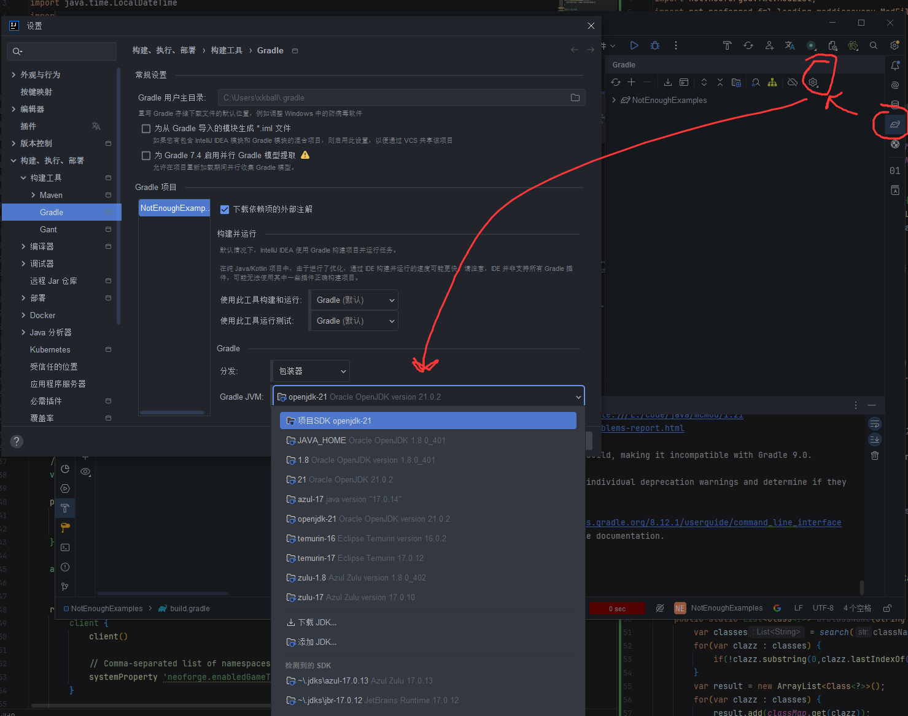

# 开发环境安装 & 第一个方块和物品

## 前言

这篇教程原始目的是作为社团课程，但无论你从哪里以何种形式阅读到此篇教程，笔者都很希望它能够帮助你开发出自己想要的模组。

以下是一些说明：

* 基于Minecraft1.21.1和NeoForge模组加载器。
* 为什么选择这个版本? 笔者对其最熟悉，仅此而已。
* 如有疑问欢迎加入前往[问题追踪器]()或者QQ群聊：(待填)进行讨论,笔者也会尽力答疑.
* 本教程尽可能照顾编程水平较低的读者，但是请确保您至少拥有**大学非计算机专业C/C++/Java/Python入门课程**结课后的水平，过于基础的编程问题可能不适合在Minecraft Mod开发社群讨论。
* 如果你没有面对对象程序的编程经验（比如只学习过C），你可能需要额外学习面对对象编程，本教程的java部分可能对你有帮助。
* 本教程文本内容可以在[这里]()查看，以[CC BY-NC-SA 4.0](https://creativecommons.org/licenses/by-nc-sa/4.0)协议公开.本教程代码部分可以在[这里]()查看,

推荐阅读:

* [为什么你学不会Minecraft模组开发 作者:雪泥Snownee](https://www.bilibili.com/read/cv24543904/)
* [Java，编程与Mod 作者:道家深湖](https://www.bilibili.com/opus/539924221435739792)
* [Harbinger-Minecraft1.12.2模组开发指南](https://harbinger.covertdragon.team/)（推荐读前言，正文已经严重过时）

这篇教程的目的（或者说是期望吧）是培养出能独立开发模组的作者，以第二篇推荐阅读的话说，能完成大师级需求的作者，所以部分内容可能较为跳脱和复杂，还请一定与我们讨论和交流。闭门造车有弊无利，独立开发也并非考试，只能用自己的大脑。

## 开发环境安装

### Intellij IDEA安装和配置

我们使用Intellij IDEA进行模组开发，免费的Community版本足以满足开发过程中所有需求，当然想要使用Ultimate版本也有以下手段免费使用正版:

* 进行学生认证获得教育授权(可以使用学信网报告，单次有效期一年,可以续)。
* 有长期维护的开源项目(传闻为至少三个月)可以申请开源开发许可证。

具体获取方法请浏览JetBrains官网，本教程不再赘述。

[点这里打开下载页面](https://www.jetbrains.com/zh-cn/idea/download)

成功安装后打开你应该看到一个类似界面，找到插件一栏，在Marketplace页可以搜索并下载插件。

必须安装的插件:

* Minecraft Development，提供了大量MC模组开发的辅助功能。

推荐安装的插件:

* Chinese(Simplified) Language Pack，汉化包，理论上应该已经捆绑安装,直接启用即可。
* Rainbow Brackets，提供大小括号染色功能。
* CodeGlancePro，提供一个类似VSCode的代码小地图滚动条。
* K9tools，不能在Marketplace下载，[所以点这里](https://github.com/TT432/k9tools)，提供Codec生成功能(你现在不需要知道Codec是什么)。
* Code Complexity，提供一个图一乐的代码复杂度分析，但是有时确实能提醒你代码可能写的太复杂需要重构。
* Translation，机翻，伟大无需多言。
* Darkyen's Time Tracker或者WakaTime，后者需要登陆第三方网站，记录你~~浪费~~花了多少时间写代码。
* Byte Code Analyzer，如果你想进修~~黑魔法~~字节码操作，这个插件会很有用。

下载插件和接下来下载开发环境都可能因为种种原因速度缓慢，如果你有网络代理可以在 **设置/外观与行为/系统设置/HTTP代理** 配置网络代理.。你可能需要先随便打开一个什么文件夹才能进入正常界面然后右上角**文件/设置**才能打开设置。

MC1.21.1使用Java21，因此我们也需要使用Java21，不用看网上有些又要翻网站又要改PATH的jdk安装方法，IDEA提供了傻瓜式的JDK安装，打开**文件/项目结构/项目**，在SDK下拉框中选择下载JDK，然后随便选一个(不要选到其他版本里面)下载就行。不同供应商的JDK在普通模组开发中几乎不会有影响。

### NeoForge开发环境安装

终于可以开始正题了。或许你应该先起好模组项目的名字？本教程以NotEnoughExanples为例。

[访问这里](https://github.com/NeoForgeMDKs/MDK-1.21.1-ModDevGradle)下载NeoForge的MDK(Mod Development Kit)。

NeoForge现在有两套开发工具链分别是ModDevGradle和NeoGradle，本教程不讨论它们的区别，只使用ModDevGradle。

有两种方法使用这个MDK，一种是点击use this template并clone到本地，但是由于涉及git知识，本教程暂不涉及。我们使用第二种,DownloadZIP。下载zip后可以选一个喜欢的文件夹解压**（注意可能套娃）**并修改文件夹名为你的项目名。在IDEA中选择**文件/打开/你刚刚解压出来的文件夹**来打开这个项目

打开项目后，IDEA会自动开始导入，如果读者此前安装过其他版本JDK，可能会因为JDK版本过低无法导入项目，如图可以切换构建工具使用的JVM。经过因人而异的一段时间后，如果有报错大概率是网络问题，多重试几次。而如果控制台出现**BUILD SUCCESSFUL**，那么恭喜你，成功完成了项目导入，可以开始开发Mod之旅了！

## 第一个方块和物品

其实在完成项目导入后,MDK的示例代码已经帮你创建了第一个物品和方块。在右侧打开gradle侧栏，运行**你的项目名/Tasks/mod development/runClient**就可以打开游戏查看。

打开创造模式物品栏即可找到创建的第一个物品，它甚至可以吃。

输入*/give @s examplemod:example_block*即可获得创建的第一个方块物品，可以摆下来。

todo......

## 许可证

  
本文采用 [CC BY-NC-SA 4.0](https://creativecommons.org/licenses/by-nc-sa/4.0) 协议共享。